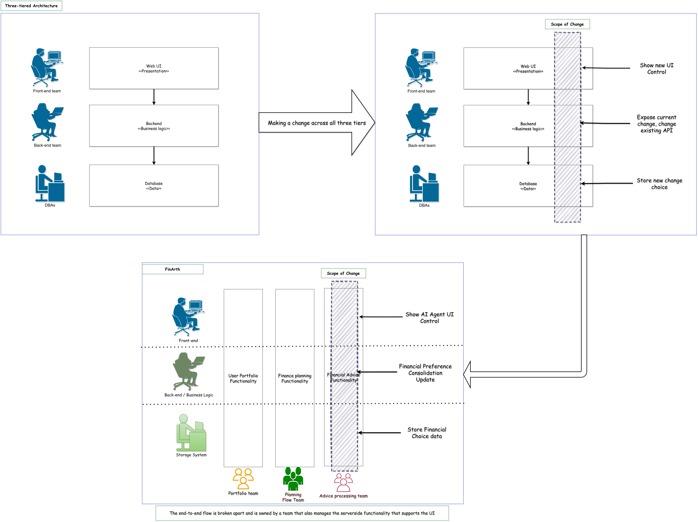
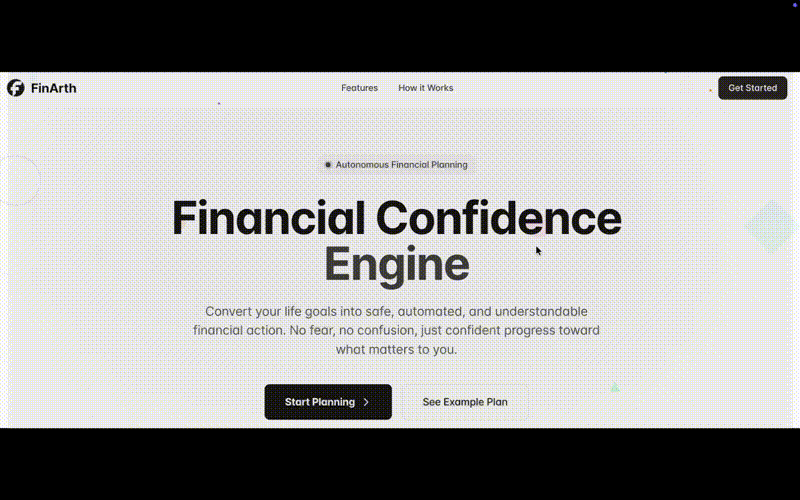
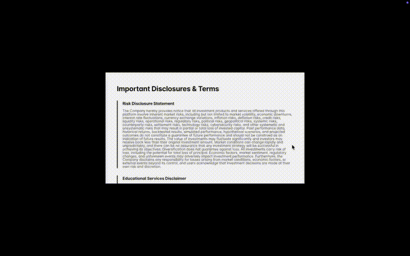
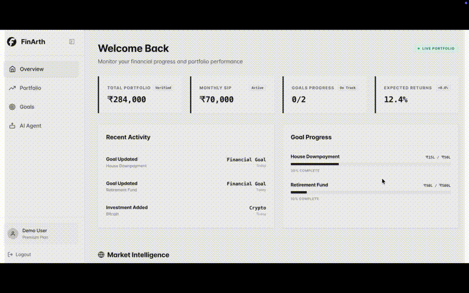

<div align="center">

```
╔══════════════════════════════════════════════════════════════════════════════╗
║                                   FINARTH                                    ║
║                          AI-POWERED FINANCE ADVISOR                          ║
╚══════════════════════════════════════════════════════════════════════════════╝
```
# F I N A R T H
## 『 FINANCIAL CONFIDENCE ENGINE FOR THE MODERN INVESTOR 』

**[WEB DASHBOARD](https://fin-arth-frontend.vercel.app)** • **[DEMO VIDEO](https://youtu.be/fg12rBUx_O0)** • **[TECHNICAL DOCUMENTATION](./docs/)**

</div>

## Introduction

FinArth is an AI-powered financial planning platform that converts life goals into safe, automated, and understandable financial action. It helps users move from financial uncertainty to confident investment decisions through personalized guidance and transparent recommendations.

## Architecture

In order to architect our FinArth system, we had to come-up with a basic high-level system design diagram.

### High Level Design


Initially, FinArth followed traditional three-tier architecture as shown in the diagram below.



Based on the project's progress it is growing towards modular monolith architecture and it can migrate to a microservices architecture in future based on project's budget, bandwidth, scope, and maintenance.

### Components

As represented in the three-tier architectural diagram above, we have three main components:

1. Frontend system
2. Backend system
3. Storage system

### Communication API

In order to establish the communication between front and back-end systems we had to choose a communication API and a web-framework. Also, to facilitate AI agent interaction, we had to choose one third-party API.

#### Systems Communication

As FinArth required bi-directional communication, we considered websockets.

#### AI Agent Communication

To provide personalised efficient financial advice by considering user's preferences, we considered the APIs below.

##### AI Agent API Matrix

<table>
    <tr>
        <th>API Name</th>
        <th>Purpose</th>
    </tr>
    <tr>
        <td><code>Opik</code></td>
        <td>We are using the Opik API to trace, log, debug, and evaluate the AI agent conversations to provide better solutions to our end-user.</td>
    </tr>
    <tr>
        <td><code>OpenAI</code></td>
        <td>We are using the OpenAI API to send the customized user prompts using OpenRouter defined AI models through opik.</td>
    </tr>
    <tr>
        <td><code>CoinGecko</code></td>
        <td>We are using the CoinGecko API(Analyst Plan) to refresh the market data.</td>
    </tr>
    <tr>
        <td><code>Weexs</code></td>
        <td>We are using the Weexs(CEX) API to calculate investment growth.</td>
    </tr>
</table>

#### Technology Matrix

There can be more choices when it comes to technology selection, but we stick to the ones below.

<table>
    <tr>
        <th>System</th>
        <th>Technology</th>
        <th>Purpose</th>
    </tr>
    <tr>
        <td rowspan="4"><strong>Frontend System</strong></td>
        <td><code>HTML</code></td>
        <td>We used HTML to render our web-page by embedding executable code.</td>
    </tr>
    <tr>
        <td><code>CSS</code></td>
        <td>We used Cascading Style Sheet to style our webpage.</td>
    </tr>
    <tr>
        <td><code>TypeScript</code></td>
        <td>We are using TypeScript to make our webpage actionable.</td>
    </tr>
    <tr>
        <td><code>React</code></td>
        <td>We are using React to build our interfaces.</td>
    </tr>
    <tr>
        <td rowspan="2"><strong>Backend System</strong></td>
        <td><code>Python</code></td>
        <td>We used Python programming to code our business logic.</td>
    </tr>
    <tr>
        <td><code>Flask</code></td>
        <td>We used Flask to register api endpoints to ease the communication between client and server.</td>
    </tr>
    <tr>
        <td><strong>Storage System</strong></td>
        <td><code>Sqlite</code></td>
        <td>We used sqlite to store user and their financial preference data.</td>
    </tr>
</table>

##### Technology Significance

<table>
    <tr>
        <th>Technology</th>
        <th>Significance</th>
    </tr>
    <tr>
        <td><code>HTML</code></td>
        <td>A standard markup language for documents designed to be displayed in a web browser. Hyper Text Mark-up Language is one of widely used languages for webpage development.</td>
    </tr>
    <tr>
        <td><code>CSS</code></td>
        <td>Cascading Style Sheets (CSS) is a style sheet language used for specifying the presentation and styling of a document written in a markup language, such as HTML or XML (including XML dialects such as SVG, MathML, or XHTML). CSS gives us more flexibility to style any kind of webpage.</td>
    </tr>
    <tr>
        <td><code>TypeScript</code></td>
        <td>TypeScript is a language for application scale JavaScript development. As the name suggests, Type Script is a type checked language and gives us convenience to reuse Java Script functionality.</td>
        <td></td>
    </tr>
    <tr>
        <td><code>React</code></td>
        <td>React is a JavaScript library for building user interfaces.</td>
    </tr>
    <tr>
        <td><code>Python</code></td>
        <td>Python is a programming language that lets you work quickly and integrate systems more effectively. It is an Object Oriented Language that was written in C language. It resembles object oriented behaviour.</td>
    </tr>
    <tr>
        <td><code>Flask</code></td>
        <td>A simple framework for building complex web applications.</td>
    </tr>
    <tr>
        <td><code>Sqlite</code></td>
        <td>A file based storage and best for any kind of projects that are at initial stage. Widely used for desktop based applications etc.</td>
    </tr>
</table>

#### Feature Matrix

What are the features that we offer to the end-user? Let's dive into each one of them.

<table>
    <tr>
        <th colspan="2">Feature</th>
        <th>Description</th>
    </tr>
    <tr>
        <td colspan="2">Home page</td>
        <td>We used HTML to render our web-page by embedding executable code.</td>
    </tr>
    <tr>
        <td rowspan="2"><strong>Login</strong></td>
        <td>Sign-up</td>
        <td>User registration / Sign-up where user is allowed to register to our system.</td>
    </tr>
    <tr>
        <td>Log-in</td>
        <td>User login interface where user is allowed to login to our system.</td>
    </tr>
    <tr>
        <td rowspan="8"><strong>Onboarding</strong></td>
        <td>Agreement</td>
        <td>The agreement focuses on the risks, limitations, and other terms & conditions.</td>
    </tr>
    <tr>
        <td>Name</td>
        <td>User Name</td>
    </tr>
    <tr>
        <td>Country Name</td>
        <td>User's Country Name</td>
    </tr>
    <tr>
        <td>Age</td>
        <td>User's Age</td>
    </tr>
    <tr>
        <td>Risk Preference</td>
        <td>We seek user to select their risk preference from one of the categories- conservative or moderate or aggressive</td>
    </tr>
    <tr>
        <td>Investment Recommendation Preference</td>
        <td>We allow user to make their choice of investment preference through categories - fixed deposits, mutual funds, stocks, bonds, real estates, gold, crypto, and ppf/epf.</td>
    </tr>
    <tr>
        <td>Return estimate expectation</td>
        <td>We allow user to make their choice of return estimate preference through 3 different categories.</td>
    </tr>
    <tr>
        <td>Financial Objectives</td>
        <td>We allow user to make their choice of financial preference through 8 or more different categories.</td>
    </tr>
    <tr>
        <td rowspan="4"><strong>Dashboard</strong></td>
        <td>Financial overview.</td>
        <td>User can monitor their financial progress and portfolio performance.</td>
    </tr>
    <tr>
        <td>Portfolio.</td>
        <td>User can track their investments with real-time insights.</td>
    </tr>
    <tr>
        <td>Goals.</td>
        <td>Convert specific life goals into actionable financial plans</td>
    </tr>
    <tr>
        <td><strong>AI Agent</strong></td>
        <td>AI-Powered Financial Planning: Intelligent analysis and personalized investment recommendations</td>
    </tr>
</table>

## Data Flow Diagram

How data will flow through the features we listed above? Let's take a look.


## Web Interface

We can view FinArth web interface through the video links below.

### Home page



### Onboard page



### Dashboard page



## Project Structure

This is the high-level project folder structure and corresponding details.

```
FinArth
├── backend/             # back-end & storage system functionality
|   ├── db/              # Database schema and migrations
│   ├── scripts/         # stand-alone scripts to experiment the opik functionality
│   ├── src/             # FinArth business logic lies here along with storage system.
│   ├── tests/           # test-cases using pytest framework.
│   └── vercel.json      # backend Python deployment
├── CHANGELOG.md         # version log maintenance
├── deploy-backend.sh    # vercel supporting file
├── docs                 # project technical documentation
├── frontend             # front-end system functionality
│   ├── package.json     # monorepo structure with frontend/backend workspaces
│   ├── postcss.config.js   # CSS processing with Tailwind CSS and Autoprefixer plugins
│   ├── public/          # public hosting attributes.
│   ├── src/             # Frontend source code folder
│   ├── tailwind.config.js  # defining design systems like fonts, colors, animations
│   └── vercel.json      # frontend python deployment
├── market_cache.json    # run time cache file to store CoinGecko API responses.
├── media/               # design and documentation references are placed in this folder.
├── package-lock.json    # an auto generated file to ensure consistent dependency versions across installations
├── package.json         # Workspace configuration.
├── pytest.ini           # definition of Python test discovery paths.
└── README.md            # Project detail document.
└── venv                 # virtual environment setup to support back-end
                         # system launch
```

We can find the detailed project structure [here](./docs/project_structure.md).

## Demo Ready Features

- User Registration & Login
- Onboarding
- Dashboard

## Operative Channels

Live Deployment: [Vercel Deployed Link](https://fin-arth-frontend.vercel.app)
Documentation: [Project Technical Documentation Link](./docs/)
Manual Demonstration: [YouTube Link](https://youtu.be/fg12rBUx_O0)

## Build

### Production Scope
Currently, we hosted our frontend system of our project on the production system through versal. We can access it through this [link](https://fin-arth-frontend.vercel.app).

## Dependencies

- Opik: Logging, debugging, and analysis of AI agent user conversation
- GitHub: Code host
- Vercel: Deployment host

## Important Disclaimers

We are not financial advisors. This platform is for educational purposes only. Please do your own research (DYOR) and consult with qualified financial professionals before making investment decisions.

---